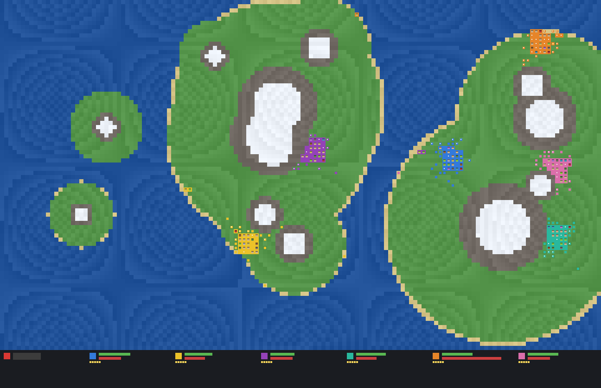

# agents.exe

**The first game written in [LDP3](https://github.com/jvpts11/LDP3).**

agents.exe is a real-time civilisation sandbox: seven nations grow, farm, build, raise armies,
sail, colonise and wage war on a procedurally generated archipelago — all autonomously, rendered
as living pixel-art. It began as João Victor Pereira Tavares's undergraduate project; this is that
world brought to life as the first full game implemented in LDP3, and it doubles as a proving ground
that exercises the language end to end — classes and inheritance, interfaces, enums, records,
generics, operator overloading, value semantics, manual memory with destructors, and a plugged-in
native library (LDP3-OpenGL) for the graphics.



## What runs in a game

- **An archipelago world** — several continents and islands rise out of the sea from layered radial
  noise, ringed by beaches, capped with mountains and snow.
- **Seven nations**, each of a distinct personality (Aggressive, Cautious, Expansionist, Mercantile,
  Cunning, Pious, Stoic) that colours every strategic choice its Leader makes.
- **A full economy** — twelve building types (town hall, farm, sawmill, three sizes of house,
  barracks, hunters' lodge, castle, marketplace, fishing hut, smithy) raised from need, and a supply
  chain of food, wood, planks, stone, iron and gold.
- **Twelve professions** — woodcutter, farmer, miner, builder, sawyer, hunter, tree-planter, fisher,
  trader, soldier, general and boat-crew — each a small finite-state machine.
- **Naval colonisation** — nations that outgrow their island build boats, cross the sea and found
  new capitals on empty shores.
- **Technological eras** — Stone → Bronze → Iron → Medieval → Industrial; research accrues from
  people, buildings and wealth, and each era boosts output.
- **War and succession** — armies march on enemy capitals, dwell to conquer them, kings die and are
  succeeded, and defeated nations dissolve.

## Architecture (two decision layers)

The original game put a fine-tuned language model in the Leader's seat, falling back to a
deterministic rule cascade on any failure. This build has **no model**: it always runs the cascade,
so every decision is reproducible from the world seed.

1. **Tactical layer** — every person is a `Worker` finite-state machine that moves by a cached BFS
   flow-field toward the capital and runs the economy: gathering, building, farming, hunting,
   fishing, planting, sailing and fighting.
2. **Strategic layer** — every ~45 ticks each nation's Leader emits one `Intent` (DeclareWar,
   BuildArmy, FoundCity, FocusResource, PrioritizeBuilding, AttackCity, NameHeir, MakePeace, …)
   from the live nation and world state, through the `MockHeuristic` cascade; `IntentDispatcher`
   applies it, nudging the tactical layer.

Everything advances off one tick: world generation, gathering, building growth, production and
processing, births and death, combat and dwell-based conquest, boats and colonisation, research and
era progression, royal succession and nation dissolution.

## Rendering

Drawing goes through one `Painter` interface with two back ends, so the CPU and GPU share a single
`Scene`:

- **`GlPainter`** — the real front end, batching pixel-space quads through **LDP3-OpenGL** (plugged
  in as a native library) in a single draw call per frame.
- **`SoftPainter`** — a pure-LDP3 CPU rasteriser that writes a PPM image, used to verify the scene
  in a headless environment where no GL context exists.

`main` opens a GL window and runs the live loop; if the window cannot open, it falls back to the
software renderer and saves frames to disk.

## Layout

The code is organised as a flagship — one type per file, grouped into folders, each folder its own
namespace under the `Agents` bundle:

| Namespace | Folder | Holds |
|---|---|---|
| `Agents.Math` | `src/math/` | value-type maths (`Vec2`) |
| `Agents.World` | `src/world/` | world generation, biomes, the grid, resource nodes, flow-field |
| `Agents.Economy` | `src/economy/` | resources, stockpiles, buildings |
| `Agents.People` | `src/people/` | workers, professions, traits, nations, the royal line |
| `Agents.Strategy` | `src/strategy/` | intents and the Leader's decision cascade |
| `Agents.Sim` | `src/sim/` | the `Realm` orchestrator that runs every system |
| `Agents.Gfx` | `src/gfx/` | the `Painter` interface, both back ends and the `Scene` |
| `Agents.App` | `src/main.ldp3` | the entry point |

## Build & run

Needs the LDP3 toolchain (the sibling `../LDP3` dev build, or an installed `ldp3` on `PATH`) with
the LDP3-OpenGL library plugged in:

```
ldp3 build
build-output/AgentsExe.exe
```

It raises an archipelago, seats seven nations, and simulates their rise, spread and wars, painting
the world and a per-nation dashboard (population, army, era) as it goes.
